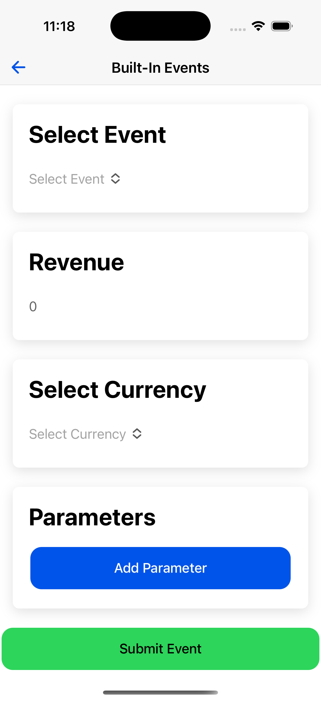
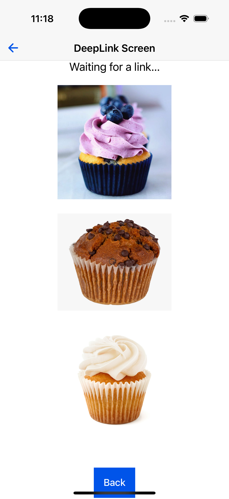
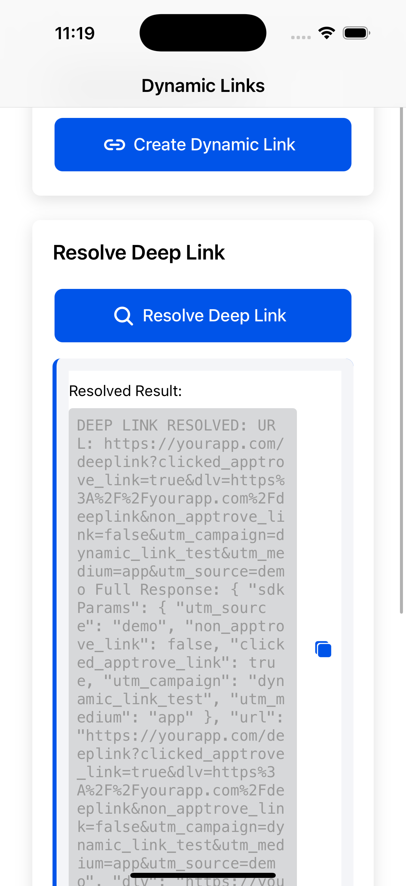
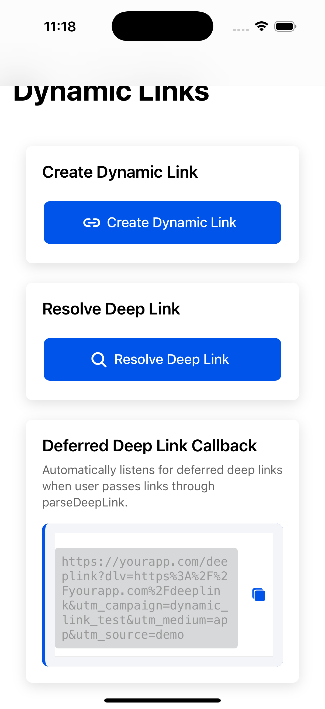
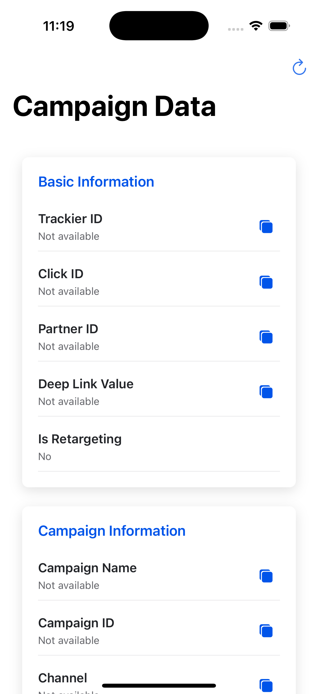
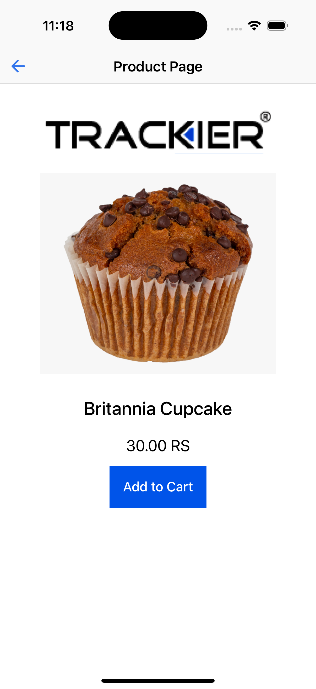

# Trackier SDK Integration - Cordova Simulator App

## AppTrove Cordova SDK Documentation

The AppTrove Cordova SDK empowers developers to integrate advanced analytics and marketing capabilities into Cordova-based hybrid applications for Android and iOS platforms. Designed for seamless tracking of user acquisition, in-app events, revenue, and deep links, this SDK enables precise campaign attribution and enhanced user engagement.

### Key Features

* **Attribution Tracking**: Accurately attribute app installs to specific marketing campaigns for detailed source analysis.
* **Event Tracking**: Capture built-in and custom events to gain insights into user behavior and interactions.
* **Revenue Tracking**: Track in-app revenue with currency support to evaluate monetization performance.
* **Deep Linking**: Support normal and deferred deep links to direct users to specific in-app content, improving engagement.
* **User Data Integration**: Pass user information (e.g., user ID, email) to enhance personalization and correlation with Trackier data.
* **SDK Signing**: Ensure request authenticity and data integrity with secret ID and key configurations.
* **Campaign Data Retrieval**: Access detailed campaign data (e.g., ad ID, campaign name) for personalized user experiences and analytics.
* **Uninstall Tracking**: Monitor app uninstalls on Android using Firebase integration for comprehensive user lifecycle tracking.

### Requirements

* Cordova 9.0 or later
* Node.js and npm for package management
* For Ionic Native apps:  
   * Ionic CLI and Capacitor for project synchronization  
   * @awesome-cordova-plugins/core package
* For Android:  
   * Android API 21 (Android 5.0) or later  
   * Google Play Services Ads Identifier library (version 18.0.1 or later)  
   * Android Install Referrer library (version 2.2 or later)
* For iOS:  
   * iOS 10.0 or later  
   * Xcode 12.0 or later
* Trackier MMP account with access to SDK key
* Internet connection for downloading the SDK package

### Documentation Reference

For complete documentation and integration guides, visit: [AppTrove Cordova SDK Documentation](https://developers.apptrove.com/docs/cordova-sdk/intro)

---

This document provides a comprehensive overview of the Trackier SDK integration in the Cordova Simulator application, including all implemented features, event tracking, deep linking, and dynamic link functionality.

## Table of Contents
- [SDK Initialization](#sdk-initialization)
- [Event Tracking](#event-tracking)
- [Deep Link Handling](#deep-link-handling)
- [Dynamic Link Creation](#dynamic-link-creation)
- [Deferred Deep Link Resolution](#deferred-deep-link-resolution)
- [Apple Ads Token Integration](#apple-ads-token-integration)
- [Firebase Analytics Integration](#firebase-analytics-integration)
- [Campaign Data Retrieval](#campaign-data-retrieval)
- [File Locations](#file-locations)
- [Configuration](#configuration)
- [Logging and Debugging](#logging-and-debugging)
- [Platform Support](#platform-support)
- [Usage Instructions](#usage-instructions)

## SDK Initialization

**Location**: `src/app/app.module.ts`

The Trackier SDK is initialized in the main App module with comprehensive configuration:

```typescript
// SDK Configuration with environment variables
private initializeTrackierSDK() {
  const key = "xxxxjxxjxjxjxjxjxkxkxkxkxxxx";
  const trackierConfig = new TrackierConfig(key, TrackierEnvironment.Development);
  
  // Platform-specific configurations
  trackierConfig.setAndroidId("User Android Id 1234567890"); // Android only
  trackierConfig.setFacebookAppId("Your Facebook App id"); // Android only
  
  // Initialize Trackier SDK
  this.trackierCordovaPlugin.initializeSDK(trackierConfig).then(() => {
    console.log("Trackier SDK initialized successfully.");
    
    // Set Trackier ID as Firebase User Property
    this.trackierCordovaPlugin.getTrackierId()
      .then(val => this.firebaseAnalytics.setUserProperty("ct_objectId", val))
      .catch(e => console.log('error: ', e));
    
    // Get Apple Ads Token and send to SDK (iOS only)
    if (this.platform.is('ios')) {
      this.getAppleAdsToken();
    }
    
    // Set up deferred deep link callback
    this.setupDeferredDeeplinkCallback();
    
    // Parse deep link for testing
    setTimeout(() => {
      this.trackierCordovaPlugin.parseDeepLink("https://trackier58.u9ilnk.me/d/8X7iwyXsyA")
        .then((result) => console.log("parseDeepLink result:", result))
        .catch((error) => console.error("Error parsing deep link:", error));
    }, 1000);
  });
}
```

**Key Features:**
- Environment-based configuration
- Development/Production environment support
- Platform-specific configurations (Android/iOS)
- Firebase Analytics integration
- Apple Ads Token integration for iOS
- Deferred deep link callback setup
- Deep link parsing for testing

## Event Tracking

### 1. Built-in Events
**Location**: `src/app/built-in-events/built-in-events.page.ts`

Comprehensive built-in event tracking with dynamic parameters:

```typescript
// Available built-in events with their corresponding event IDs
const eventsList = [
  'ADD_TO_CART',      // Fy4uC1_FlN
  'LEVEL_ACHIEVED',   // 1CFfUn3xEY
  'ADD_TO_WISHLIST',  // AOisVC76YG
  'COMPLETE_REGISTRATION', // mEqP4aD8dU
  'TUTORIAL_COMPLETION',   // 99VEGvXjN7
  'PURCHASE',         // Q4YsqBKnzZ
  'SUBSCRIBE',        // B4N_In4cIP
  'START_TRIAL',      // jYHcuyxWUW
  'ACHIEVEMENT_UNLOCKED', // xTPvxWuNqm
  'CONTENT_VIEW',     // Jwzois1ays
  'TRAVEL_BOOKING',   // yP1-ipVtHV
  'SHARE',            // dxZXGG1qqL
  'INVITE',           // 7lnE3OclNT
  'LOGIN',            // o91gt1Q0PK
  'UPDATE'            // sEQWVHGThl
];

// Event tracking with revenue and parameters
async submitEvent() {
  let trackierEvent: TrackierEvent | null = null;
  
  switch (this.selectedEvent) {
    case 'ADD_TO_CART':
      trackierEvent = new TrackierEvent('Fy4uC1_FlN');
      break;
    case 'PURCHASE':
      trackierEvent = new TrackierEvent('Q4YsqBKnzZ');
      break;
    // ... other cases
  }
  
  if (trackierEvent) {
    trackierEvent.setRevenue(this.revenue);
    trackierEvent.setCurrency(this.selectedCurrency);
    
    // Add custom parameters using setParam methods
    for (let i = 0; i < this.params.length; i++) {
      switch (i) {
        case 0: trackierEvent.setParam1(this.params[i].value); break;
        case 1: trackierEvent.setParam2(this.params[i].value); break;
        case 2: trackierEvent.setParam3(this.params[i].value); break;
        case 3: trackierEvent.setParam4(this.params[i].value); break;
        case 4: trackierEvent.setParam5(this.params[i].value); break;
        case 5: trackierEvent.setParam6(this.params[i].value); break;
        case 6: trackierEvent.setParam7(this.params[i].value); break;
        case 7: trackierEvent.setParam8(this.params[i].value); break;
        case 8: trackierEvent.setParam9(this.params[i].value); break;
        case 9: trackierEvent.setParam10(this.params[i].value); break;
      }
    }
    
    await this.trackierCordovaPlugin.trackEvent(trackierEvent);
  }
}
```

**Features:**
- 15+ built-in event types with predefined event IDs
- Revenue tracking with 10+ currency support
- Dynamic parameter system (up to 10 parameters)
- User-friendly dropdown interface
- Real-time validation and feedback



*Built-in Events Interface - Track predefined events with revenue and parameters*

### 2. Custom Events
**Location**: `src/app/customs-events/customs-events.page.ts`

Custom event tracking with flexible configuration:

```typescript
async submitEvent() {
  const trackierEvent = new TrackierEvent(this.eventId);
  
  trackierEvent.setRevenue(this.revenue);
  trackierEvent.setCurrency(this.selectedCurrency);
  trackierEvent.setCouponCode("SatyamTest10233");
  
  // Set user data
  this.trackierCordovaPlugin.setUserId("Satyan!232");
  this.trackierCordovaPlugin.setUserName("Satyam");
  this.trackierCordovaPlugin.setUserPhone("82528978393");
  this.trackierCordovaPlugin.setUserEmail("Satyam@gmail.com");
  this.trackierCordovaPlugin.setDOB("12/1/2022");
  this.trackierCordovaPlugin.setGender("Male");
  
  // Dynamic parameter assignment using setParam methods
  for (let i = 0; i < this.params.length; i++) {
    switch (i) {
      case 0: trackierEvent.setParam1(this.params[i].value); break;
      case 1: trackierEvent.setParam2(this.params[i].value); break;
      case 2: trackierEvent.setParam3(this.params[i].value); break;
      case 3: trackierEvent.setParam4(this.params[i].value); break;
      case 4: trackierEvent.setParam5(this.params[i].value); break;
      case 5: trackierEvent.setParam6(this.params[i].value); break;
      case 6: trackierEvent.setParam7(this.params[i].value); break;
      case 7: trackierEvent.setParam8(this.params[i].value); break;
      case 8: trackierEvent.setParam9(this.params[i].value); break;
      case 9: trackierEvent.setParam10(this.params[i].value); break;
    }
  }
  
  await this.trackierCordovaPlugin.trackEvent(trackierEvent);
}
```

**Features:**
- Custom event ID support
- Revenue and currency tracking
- Coupon code integration
- User data management
- Dynamic parameter system
- Input validation and error handling


*Custom Events Interface - Track custom events with flexible configuration*

## Deep Link Handling

### Deep Link Listener
**Location**: `src/app/app.module.ts`

Comprehensive deep link processing with callback setup:

```typescript
// Set up deferred deep link callback
private setupDeferredDeeplinkCallback() {
  try {
    console.log("Setting up deferred deep link callback...");
    
    this.trackierCordovaPlugin.setDeferredDeeplinkCallbackListener((uri: string) => {
      console.log("Deferred Deeplink Callback received");
      console.log("URL:", uri);
      
      // Store the deferred deeplink URI in service
      this.deferredDeeplinkService.setDeferredDeeplink(uri);
      
      // Process the deferred deeplink URL
      if (uri) {
        // Extract URL string from object or string
        let urlString = '';
        if (typeof uri === 'object' && uri !== null) {
          urlString = uri.url || uri.deepLinkValue || uri.uri || JSON.stringify(uri);
        } else if (typeof uri === 'string') {
          urlString = uri;
        }
        
        console.log("Processing deferred deep link:", urlString);
        // Handle deep link navigation and processing
      }
    });
    
    console.log("Deferred deep link callback set up successfully");
  } catch (error) {
    console.error("Error setting up deferred deep link callback:", error);
  }
}
```

### Deep Link Screen
**Location**: `src/app/deep-linking/deep-linking.page.ts`

Visual deep link testing interface:



*Deep Link Testing Interface - Test and process deep links*

```typescript
// Handle deep link navigation
handleDeepLink(link: string) {
  this.linkMessage = `Deep Link: ${link}`;
  this.isLinkAvailable = true;
  
  try {
    const url = new URL(link);
    const productId = url.searchParams.get('product_id');
    const quantity = url.searchParams.get('quantity');
    const actionData = url.searchParams.get('actionData');
    const dlv = url.searchParams.get('dlv');
    
    if (url.pathname === '/d' && productId && quantity) {
      this.router.navigate(['/cake'], {
        queryParams: { productId, quantity, actionData, dlv },
      });
    } else {
      console.warn('Unhandled deep link:', link);
      this.linkMessage = 'Link does not match expected format.';
      this.isLinkAvailable = false;
    }
  } catch (error) {
    console.error('Error handling deep link:', error);
    this.linkMessage = 'Error processing the deep link. Please try again.';
    this.isLinkAvailable = false;
  }
}
```

### Android Manifest Configuration
**Location**: `android/app/src/main/AndroidManifest.xml`

Deep link intent filters for Android:

```xml
<!-- Intent filter for deep linking -->
<intent-filter android:autoVerify="true">
    <action android:name="android.intent.action.VIEW" />
    <category android:name="android.intent.category.DEFAULT" />
    <category android:name="android.intent.category.BROWSABLE" />
    
    <!-- Custom scheme deep link -->
    <data
        android:host="www.trackier.com"
        android:pathPrefix="/product"
        android:scheme="unilink" />
    
    <!-- App Link -->
    <data
        android:host="trackier.u9ilnk.me"
        android:pathPrefix="/d/"
        android:scheme="https" />
</intent-filter>
```

## Dynamic Link Creation

**Location**: `src/app/dynamic-link/dynamic-link.page.ts`

Advanced dynamic link creation with comprehensive configuration:

```typescript
async createDynamicLink() {
  try {
    this.isLoading = true;
    
    const dynamicLinkConfig = {
      templateId: 'M5Osa2',
      link: 'https://testdeeplink',
      domainUriPrefix: 'https://trackier59.u9ilnk.me',
      deepLinkValue: 'MyMainactivity',
      
      // Platform-specific parameters
      androidParameters: {
        redirectLink: 'https://play.google.com/store/apps/details?id=com.yourapp'
      },
      iosParameters: {
        redirectLink: 'https://apps.apple.com/app/yourapp/id123456789'
      },
      desktopParameters: {
        redirectLink: 'https://yourapp.com'
      },
      
      // SDK parameters
      sdkParameters: {
        utm_source: 'demo',
        utm_medium: 'app',
        utm_campaign: 'dynamic_link_test'
      },
      
      // Social media metadata
      socialMetaTagParameters: {
        title: 'Check out this amazing app!',
        description: 'Download our app and get amazing features',
        imageLink: 'https://yourapp.com/app-icon.png'
      },
      
      // Attribution parameters
      attributionParameters: {
        channel: 'social',
        campaign: 'summer_sale',
        mediaSource: 'facebook',
        p1: 'param1_value',
        p2: 'param2_value',
        p3: 'param3_value',
        p4: 'param4_value',
        p5: 'param5_value'
      }
    };
    
    this.createdDynamicLink = await this.trackier.createDynamicLink(dynamicLinkConfig);
    await this.showToast('Dynamic link created successfully!');
  } catch (error) {
    console.error('Error creating dynamic link:', error);
    this.createdDynamicLink = 'Error: ' + error;
    await this.showToast('Error creating dynamic link: ' + error);
  } finally {
    this.isLoading = false;
  }
}
```

**Features:**
- Template-based link creation
- Multi-platform support (Android, iOS, Desktop)
- Social media metadata integration
- SDK and attribution parameters
- Error handling and user feedback
- Clipboard integration for easy sharing



*Deep Link Resolver - Resolve and analyze deep link data*



*Deferred Deep Link Callback - Handle deferred deep links*

## Deferred Deep Link Resolution

**Location**: `src/app/dynamic-link/dynamic-link.page.ts`

Advanced deep link resolution with data parsing:

```typescript
async testProvidedLink() {
  try {
    this.isLoading = true;
    
    const urlToResolve = 'https://trackier58.u9ilnk.me/d/8X7iwyXsyA';
    const result = await this.trackier.resolveDeeplinkUrl(urlToResolve);
    
    if (result && result.url) {
      this.testResult = `DEEP LINK RESOLVED:\nURL: ${result.url}\n\nFull Response: ${JSON.stringify(result, null, 2)}`;
      await this.showToast('Deep link resolved successfully!');
    } else {
      this.testResult = `No URL returned from resolver\nFull Response: ${JSON.stringify(result, null, 2)}`;
      await this.showToast('No URL returned from resolver');
    }
  } catch (error) {
    this.testResult = 'Error resolving deep link: ' + error;
    await this.showToast('Error resolving deep link: ' + error);
  } finally {
    this.isLoading = false;
  }
}
```

**Features:**
- URL resolution with detailed data extraction
- Sample URL testing
- Custom URL input and resolution
- Structured data display
- Error handling and user feedback

## Apple Ads Token Integration

**Location**: `src/app/app.module.ts`

iOS-specific Apple Ads Token integration:

```typescript
private async getAppleAdsToken() {
  try {
    // Only run on iOS
    if (!this.platform.is('ios')) {
      console.log("Apple Ads Token only available on iOS");
      return;
    }
    
    console.log("Getting Apple Ads Token...");
    
    // First request tracking authorization
    const trackingResult = await AdvertisingId.requestTracking();
    
    if (trackingResult.value === 'Authorized') {
      // Permission granted, get the advertising ID
      const advertisingResult = await AdvertisingId.getAdvertisingId();
      const token = advertisingResult.id;
      
      console.log("Apple Ads Token received:", token);
      
      if (token) {
        this.trackierCordovaPlugin.updateAppleAdsToken(token);
        console.log("Apple Ads Token sent to Trackier SDK successfully");
      } else {
        console.log("No Apple Ads Token available");
      }
    } else {
      console.log("Tracking permission denied or restricted");
    }
  } catch (error) {
    console.error("Error getting Apple Ads Token:", error);
  }
}
```

**Features:**
- iOS-specific implementation
- Tracking authorization request
- Advertising ID retrieval
- Automatic token update to Trackier SDK
- Error handling and logging

## Firebase Analytics Integration

**Location**: `src/app/services/firebase-analytics.service.ts`

Firebase Analytics integration for uninstall tracking:

```typescript
export class FirebaseAnalyticsService {
  async setUserProperty(name: string, value: string): Promise<void> {
    try {
      if (window.FirebaseAnalytics) {
        await window.FirebaseAnalytics.setUserProperty({ name, value });
        console.log(`Firebase Analytics: Set user property ${name} = ${value}`);
      } else {
        console.warn('Firebase Analytics not available');
      }
    } catch (error) {
      console.error('Error setting Firebase user property:', error);
      throw error;
    }
  }
}
```

**Features:**
- User property setting for Firebase Analytics
- Trackier ID integration
- Uninstall tracking support
- Error handling and logging

## Campaign Data Retrieval

**Location**: `src/app/campaign-data/campaign-data.page.ts`

Comprehensive campaign data retrieval:

```typescript
interface CampaignData {
  trackierId: string;
  ad: string;
  adId: string;
  campaign: string;
  campaignId: string;
  adSet: string;
  adSetId: string;
  channel: string;
  p1: string;
  p2: string;
  p3: string;
  p4: string;
  p5: string;
  clickId: string;
  dlv: string;
  pid: string;
  isRetargeting: boolean;
}

async retrieveCampaignData() {
  try {
    // Retrieve all campaign data using individual promises
    this.campaignData.trackierId = await this.getCampaignValue(() => this.trackierCordovaPlugin.getTrackierId());
    this.campaignData.ad = await this.getCampaignValue(() => this.trackierCordovaPlugin.getAd());
    this.campaignData.adId = await this.getCampaignValue(() => this.trackierCordovaPlugin.getAdID());
    this.campaignData.campaign = await this.getCampaignValue(() => this.trackierCordovaPlugin.getCampaign());
    this.campaignData.campaignId = await this.getCampaignValue(() => this.trackierCordovaPlugin.getCampaignID());
    this.campaignData.adSet = await this.getCampaignValue(() => this.trackierCordovaPlugin.getAdSet());
    this.campaignData.adSetId = await this.getCampaignValue(() => this.trackierCordovaPlugin.getAdSetID());
    this.campaignData.channel = await this.getCampaignValue(() => this.trackierCordovaPlugin.getChannel());
    this.campaignData.p1 = await this.getCampaignValue(() => this.trackierCordovaPlugin.getP1());
    this.campaignData.p2 = await this.getCampaignValue(() => this.trackierCordovaPlugin.getP2());
    this.campaignData.p3 = await this.getCampaignValue(() => this.trackierCordovaPlugin.getP3());
    this.campaignData.p4 = await this.getCampaignValue(() => this.trackierCordovaPlugin.getP4());
    this.campaignData.p5 = await this.getCampaignValue(() => this.trackierCordovaPlugin.getP5());
    this.campaignData.clickId = await this.getCampaignValue(() => this.trackierCordovaPlugin.getClickId());
    this.campaignData.dlv = await this.getCampaignValue(() => this.trackierCordovaPlugin.getDlv());
    this.campaignData.pid = await this.getCampaignValue(() => this.trackierCordovaPlugin.getPid());
    
    // Handle boolean value for retargeting
    const retargetingValue = await this.getCampaignValue(() => this.trackierCordovaPlugin.getIsRetargeting());
    this.campaignData.isRetargeting = retargetingValue === 'true';
    
  } catch (error) {
    console.error('Error retrieving campaign data:', error);
    this.errorMessage = 'Failed to retrieve campaign data. Please try again.';
  }
}
```

**Features:**
- Complete campaign data retrieval
- Individual parameter access
- Boolean value handling
- Error handling and fallbacks
- iOS compatibility support



*Campaign and Device Data - View campaign parameters and device information*

## File Locations

### Core SDK Files:
- **Main App Module**: `src/app/app.module.ts` - SDK initialization and configuration
- **App Component**: `src/app/app.component.ts` - App lifecycle and deep link handling
- **Home Screen**: `src/app/home/home.page.ts` - Main navigation interface
- **Built-in Events**: `src/app/built-in-events/built-in-events.page.ts` - Built-in event tracking
- **Custom Events**: `src/app/customs-events/customs-events.page.ts` - Custom event tracking
- **Deep Link Screen**: `src/app/deep-linking/deep-linking.page.ts` - Deep link testing
- **Dynamic Link Screen**: `src/app/dynamic-link/dynamic-link.page.ts` - Dynamic link creation and resolution
- **Campaign Data**: `src/app/campaign-data/campaign-data.page.ts` - Campaign data retrieval
- **Complete Event**: `src/app/complete-event/complete-event.page.ts` - Complete event tracking
- **Product Page**: `src/app/product-page/product-page.page.ts` - Product display
- **Add to Cart**: `src/app/add-to-cart-screen/add-to-cart-screen.page.ts` - Purchase tracking



*Product Page - Product display and purchase tracking*

### Service Files:
- **Deferred Deeplink Service**: `src/app/services/deferred-deeplink.service.ts` - Deep link management
- **Firebase Analytics Service**: `src/app/services/firebase-analytics.service.ts` - Firebase integration
- **Deep Linking Service**: `src/app/deep-linking/deep-linking-service.ts` - Deep link handling

### Configuration Files:
- **Package Configuration**: `package.json`
- **Capacitor Configuration**: `capacitor.config.ts`
- **Ionic Configuration**: `ionic.config.json`
- **Environment Variables**: `src/environments/environment.ts`
- **Android Manifest**: `android/app/src/main/AndroidManifest.xml`
- **Android Build**: `android/app/build.gradle`
- **iOS Configuration**: `ios/App/App/Info.plist`

## Configuration

### Dependencies (`package.json`):
```json
{
  "dependencies": {
    "@awesome-cordova-plugins/core": "^6.14.0",
    "@capacitor/android": "6.2.0",
    "@capacitor/app": "6.0.2",
    "@capacitor/core": "6.2.0",
    "@capacitor/ios": "^7.4.3",
    "@ionic-native/core": "^5.36.0",
    "@ionic-native/deeplinks": "^5.36.0",
    "@ionic/angular": "^8.4.1",
    "@capacitor-community/firebase-analytics": "^6.0.0",
    "@capacitor-community/advertising-id": "^6.0.0",
    "com.trackier.cordova_sdk": "github:trackier/cordova_sdk",
    "dotenv": "^16.4.7"
  }
}
```

### Environment Variables (`src/environments/environment.ts`):
```typescript
export const environment: Environment = {
  production: false,
  trackierSdkKey: 'xxxxjxxjxjxjxjxjxkxkxkxkxxxx',
};
```

### Android Dependencies (`android/app/build.gradle`):
```gradle
dependencies {
    implementation 'com.google.android.gms:play-services-ads-identifier:18.0.1'
    implementation 'com.android.installreferrer:installreferrer:2.2'
    implementation 'androidx.multidex:multidex:2.0.1'
    implementation 'com.google.firebase:firebase-analytics:21.5.0'
}
```

### ProGuard Rules (`android/app/proguard-rules.pro`):
```proguard
# Trackier SDK ProGuard rules
-keep class com.trackier.sdk.** { *; }
-keep class com.google.android.gms.common.ConnectionResult {
    int SUCCESS;
}
-keep class com.google.android.gms.ads.identifier.AdvertisingIdClient {
    com.google.android.gms.ads.identifier.AdvertisingIdClient$Info getAdvertisingIdInfo(android.content.Context);
}
-keep class com.google.android.gms.ads.identifier.AdvertisingIdClient$Info {
    java.lang.String getId();
    boolean isLimitAdTrackingEnabled();
}
-keep public class com.android.installreferrer.** { *; }
```

## Logging and Debugging

### Log Tags Used:
- `"Trackier"` - SDK operations logging
- `"DeepLink"` - Deep link data logging
- `"DynamicLink"` - Dynamic link creation
- `"Firebase Analytics"` - Firebase integration
- `"Apple Ads Token"` - iOS advertising ID

### Key Log Messages:
- **SDK Initialization**: "Trackier SDK initialized successfully"
- **Deep Link Received**: Complete deep link data dump
- **Event Tracking**: All tracked events with parameters
- **Dynamic Link Created**: Successfully created dynamic links
- **Campaign Data**: Retrieved campaign parameters
- **Apple Ads Token**: iOS advertising ID integration

### Console Output Examples:
```
LOG  Trackier SDK initialized successfully.
LOG  Getting Apple Ads Token...
LOG  Apple Ads Token received: 12345678-1234-1234-1234-123456789012
LOG  Apple Ads Token sent to Trackier SDK successfully
LOG  Setting up deferred deep link callback...
LOG  Deferred deep link callback set up successfully
LOG  Deferred Deeplink Callback received
LOG  URL: trackier58.u9ilnk.me/d?dlv=CakeActivity&product_id=chocochip&quantity=2
LOG  Processing deferred deep link: trackier58.u9ilnk.me/d?dlv=CakeActivity&product_id=chocochip&quantity=2
LOG  Firebase Analytics: Set user property ct_objectId = trackier_id_12345
```

## Platform Support

### Android
- **Deep Link Handling** - Intent filters and URL schemes
- **Event Tracking** - Built-in and custom events
- **Dynamic Link Creation** - Template-based link generation
- **Firebase Analytics** - Uninstall tracking integration
- **Facebook App ID** - Attribution tracking
- **Android ID** - Device identification

### iOS
- **iPhone Simulator** (iOS 18.1)
- **Deep Link Handling** - URL schemes and universal links
- **Event Tracking** - Built-in and custom events
- **Dynamic Link Creation** - Template-based link generation
- **Apple Ads Token** - Advertising ID integration
- **Firebase Analytics** - Uninstall tracking integration


*iPhone Simulator - iOS app running on simulator*

## Event Summary

| Event Type | Event ID | Location | Trigger |
|------------|----------|----------|---------|
| ADD_TO_CART | Fy4uC1_FlN | built-in-events.page.ts | User selection |
| LEVEL_ACHIEVED | 1CFfUn3xEY | built-in-events.page.ts | User selection |
| ADD_TO_WISHLIST | AOisVC76YG | built-in-events.page.ts | User selection |
| COMPLETE_REGISTRATION | mEqP4aD8dU | built-in-events.page.ts | User selection |
| TUTORIAL_COMPLETION | 99VEGvXjN7 | built-in-events.page.ts | User selection |
| PURCHASE | Q4YsqBKnzZ | built-in-events.page.ts | User selection |
| SUBSCRIBE | B4N_In4cIP | built-in-events.page.ts | User selection |
| START_TRIAL | jYHcuyxWUW | built-in-events.page.ts | User selection |
| ACHIEVEMENT_UNLOCKED | xTPvxWuNqm | built-in-events.page.ts | User selection |
| CONTENT_VIEW | Jwzois1ays | built-in-events.page.ts | User selection |
| TRAVEL_BOOKING | yP1-ipVtHV | built-in-events.page.ts | User selection |
| SHARE | dxZXGG1qqL | built-in-events.page.ts | User selection |
| INVITE | 7lnE3OclNT | built-in-events.page.ts | User selection |
| LOGIN | o91gt1Q0PK | built-in-events.page.ts | User selection |
| UPDATE | sEQWVHGThl | built-in-events.page.ts | User selection |
| Custom Events | User-defined | customs-events.page.ts | Custom event ID |
| Complete Event | B4N_In4cIP | complete-event.page.ts | SUBSCRIBE event with full parameters |
| Deep Link | Auto-detected | app.module.ts | Deep link received |
| Dynamic Link | Template-based | dynamic-link.page.ts | Link creation |

## Key Features Implemented

**SDK Initialization** - Complete setup with environment variables  
**Event Tracking** - Built-in and custom events with revenue tracking  
**Deep Link Handling** - Comprehensive deep link processing and navigation  
**Dynamic Link Creation** - Advanced link creation with multi-platform support  
**Deferred Deep Link Resolution** - URL resolution with structured data display  
**Apple Ads Token Integration** - iOS advertising ID tracking  
**Firebase Analytics Integration** - Uninstall tracking and user properties  
**Campaign Data Retrieval** - Complete campaign parameter access  
**Error Handling** - Proper error logging and user feedback  
**Logging** - Detailed logging for debugging and monitoring  
**Cross-Platform Support** - Android and iOS compatibility  
**User Interface** - Modern, user-friendly interfaces for all features  
**Environment Management** - Secure credential management  
**Parameter System** - Dynamic parameter support (up to 10 parameters)  
**Currency Support** - 10+ currency options for revenue tracking  

## Usage Instructions

1. **Setup Environment Variables**: Update `src/environments/environment.ts` with your Trackier credentials
2. **Install Dependencies**: Run `npm install` to install all required packages
3. **iOS Setup** (macOS only): Run `cd ios && pod install && cd ..`
4. **Start Development Server**: Run `ionic serve`
5. **Build for Android**: Run `ionic capacitor build android`
6. **Build for iOS** (macOS only): Run `ionic capacitor build ios`

## Testing Features

### Built-in Events Testing:
1. Navigate to "Built-in events" from home screen
2. Select an event type from dropdown
3. Enter revenue amount and select currency
4. Add custom parameters (up to 10)
5. Submit event and verify in logs

### Custom Events Testing:
1. Navigate to "Customs Events" from home screen
2. Enter custom event ID
3. Set revenue and currency
4. Add parameters as needed
5. Submit and verify tracking

### Deep Link Testing:
1. Use test URL: `https://trackier58.u9ilnk.me/d/8X7iwyXsyA`
2. Navigate to "Deep linking Page"
3. Test deep link processing
4. Verify parameter extraction and navigation

### Dynamic Link Testing:
1. Navigate to "Dynamic Links"
2. Create sample dynamic link
3. Test URL resolution
4. Verify structured data display
5. Test clipboard functionality

### Campaign Data Testing:
1. Navigate to "Campaign Data"
2. View retrieved campaign parameters
3. Test event tracking with campaign data
4. Verify data accuracy

## User Flow

1. **App Launch** → SDK initialization with user data setup
2. **Home Screen** → Navigation to different feature screens
3. **Event Tracking** → Built-in or custom event submission
4. **Deep Link Processing** → Automatic deep link detection and navigation
5. **Dynamic Link Creation** → Link generation with comprehensive configuration
6. **URL Resolution** → Deep link resolution with data extraction
7. **Campaign Data** → Campaign parameter retrieval and display


## Troubleshooting

### Common Issues:

1. **SDK Not Initializing**
   - Verify SDK key in environment file
   - Check console logs for credential errors
   - Ensure proper import statements

2. **Deep Links Not Working**
   - Verify URL format and parameters
   - Check Android manifest intent filters
   - Test with provided sample URLs

3. **Events Not Tracking**
   - Verify event IDs from Trackier panel
   - Check network connectivity
   - Monitor console logs for errors

4. **iOS Build Issues**
   - Clean and rebuild: `cd ios && rm -rf build && pod install`
   - Check Xcode project settings
   - Verify iOS deployment target

5. **Apple Ads Token Issues**
   - Ensure iOS 14+ for tracking authorization
   - Check privacy permissions
   - Verify advertising ID availability

6. **Firebase Analytics Issues**
   - Ensure google-services.json is present
   - Check Firebase project configuration
   - Verify plugin installation

## Support

For technical support and questions:
- **Documentation**: [AppTrove Cordova SDK Documentation](https://developers.apptrove.com/docs/cordova-sdk/intro)
- **Support Email**: support@trackier.com
- **GitHub Issues**: Create an issue in the repository

## License

This project is licensed under the MIT License - see the LICENSE file for details.

---

This integration provides comprehensive tracking, deep linking, and dynamic link functionality for the Cordova Simulator application using the Trackier SDK, demonstrating best practices for mobile app analytics and attribution with a modern, user-friendly interface.
